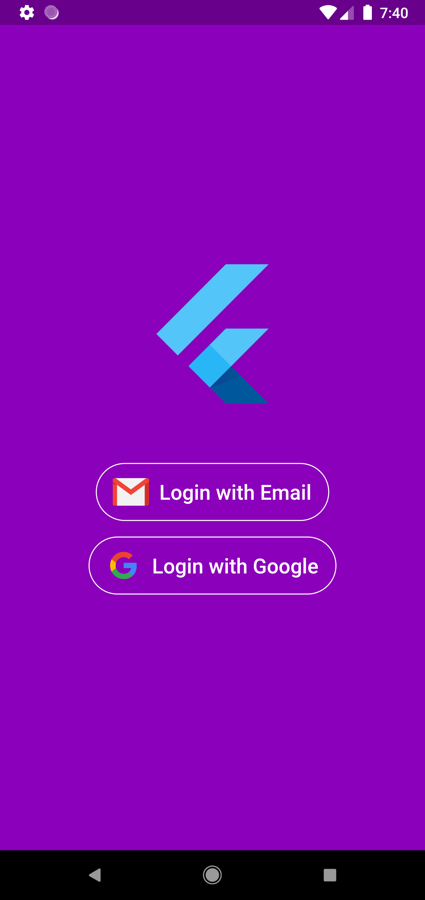
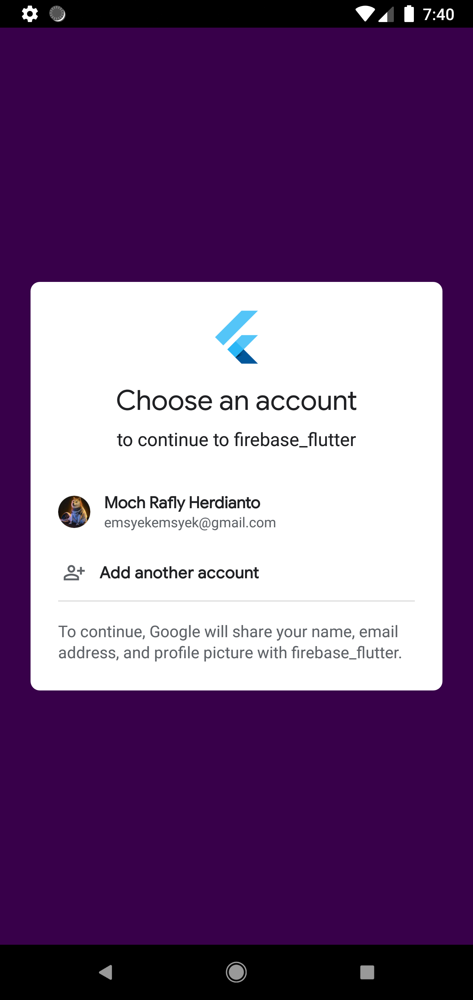
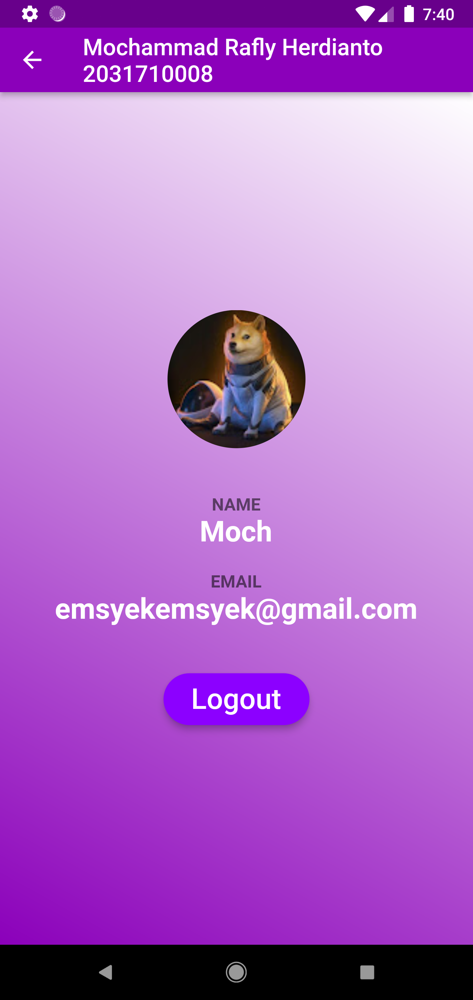
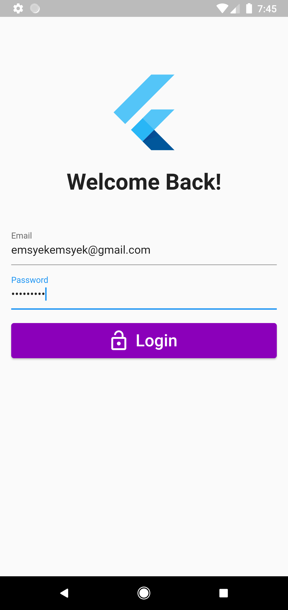
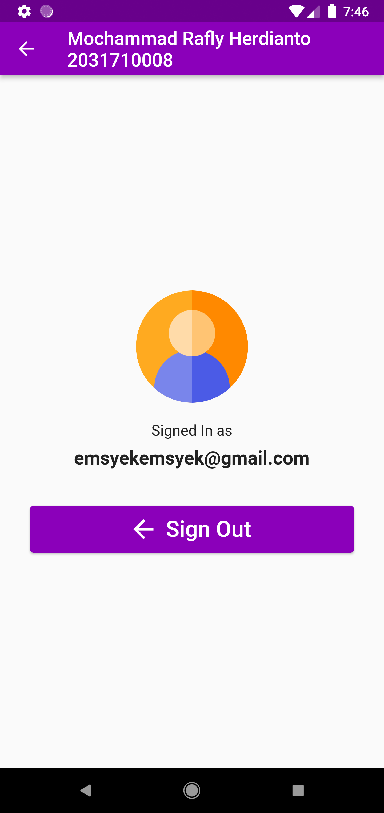

# Tugas 8 Pemrograman Mobile

Membuat Aplikasi Flutter Menggunakan Firebase

Nama  : Mochammad Rafly Herdianto  
NIM   : 2031710008  
Kelas : MI-2C  
Prodi : D3 MI  

## Hasil Praktikum

Halaman Utama Login
 

 

Halaman Konfirmasi Akun Google
 

 

Halaman Home Login Google
 

 

Halaman Login Email
 

 

Halaman Home Login Email
 

 

